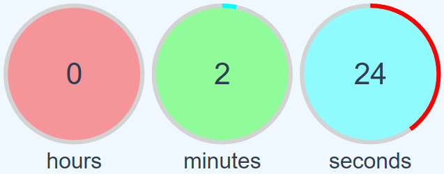
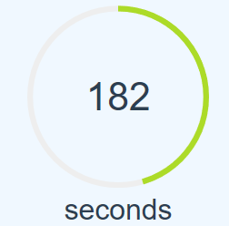

# vue-count-down-timer

This is a count down timer for Vue js framework. This library supports two types of timers:
1. Timer mode: Timer based on hour, minute and second.
2. Single mode: Timber based on second (single circle without hours and minutes).

## Installation
```
npm install vue-circular-count-down-timer
```
After installation, import component and register it in the main.js:
```
import Vue from 'vue';
import CircularCountDownTimer from "vue-circular-count-down-timer";
Vue.use(CircularCountDownTimer);
```

### Documentation

| Props | Description |
| --- | --- |
| initial-value | Initial value of timer, as seconds. (required) |
| stroke-width | Thickness of circle strokes in px. |
| seconds-stroke-color | Color of stroke of seconds circle. |
| minutes-stroke-color | Color of stroke of minutes circle. |
| hours-stroke-color | Color of stroke of hours circle. |
| underneath-stroke-color | Color of stroke of empty parts of circles. |
| seconds-fill-color | Color of background of seconds circle. |
| minutes-fill-color | Color of background of minutes circle. |
| hours-fill-color | Color of background of hours circle. |
| size | Width and height of circles in px. |
| padding | Space between circles in px. |
| hour-label | Label of hours circle.  |
| minute-label | Label of minutes circle. |
| second-label | Label of seconds circle. |
| show-second | Whether to show seconds circle or not. |
| show-minute | Whether to show minutes circle or not. |
| show-hour | Whether to show hours circle or not. |
| show-negatives | To continue counting after reaching zero. |
| steps | Number of steps in single mode usage. |
| paused | To pause counting. |
| notify-every | To determine interval of triggering update event. Possible values: second, minute, hour, none. minute and hour works just in timer mode. |

| Events | Description |
| --- | --- |
| finish | Fires when counter reaches zero. |
| update | Fires on each counting. |

| Method | Description |
| --- | --- |
| updateTime(seconds) | Adds the amount of seconds to the countdown value. Works with positive or negative integers. |


### Usage

#### 1. Basic usage

```
<circular-count-down-timer
    :initial-value="360500"
></circular-count-down-timer>
```

#### 2. Fully customized (timer mode)

```
<circular-count-down-timer
        :initial-value="360500"
        :stroke-width="5"
        :seconds-stroke-color="'#f00'"
        :minutes-stroke-color="'#0ff'"
        :hours-stroke-color="'#0f0'"
        :underneath-stroke-color="'lightgrey'"
        :seconds-fill-color="'#00ffff66'"
        :minutes-fill-color="'#00ff0066'"
        :hours-fill-color="'#ff000066'"
        :size="200"
        :padding="4"
        :hour-label="'hours'"
        :minute-label="'minutes'"
        :second-label="'seconds'"
        :show-second="true"
        :show-minute="true"
        :show-hour="true"
        :show-negatives="true"
        :paused="some_variable"
        :notify-every="'minute'"
></circular-count-down-timer>
```



#### 3. Single mode

```
<circular-count-down-timer
        :initial-value="200"
        :steps="400"
></circular-count-down-timer>
```




#### 4. Listen to events

````
<circular-count-down-timer
        :initial-value="200"
        @finish="finished"
        @update="updated"
></circular-count-down-timer>

...

methods: {
    finished: () => {
        console.log('finished');
    },
    updated: (status) => {
        console.log(status);    //{"value": 144, "seconds": 24, "minutes": 2, "hours": 0}
    }
}
````


#### 5. Add 10 seconds to the timer

````
<circular-count-down-timer
        :initial-value="200"
        @finish="finished"
        @update="updated"
        ref="countdown"
></circular-count-down-timer>

...

methods: {
    updateCountdown: () => {
        this.$refs.countdown.updateTime(10)
    }
}
````
